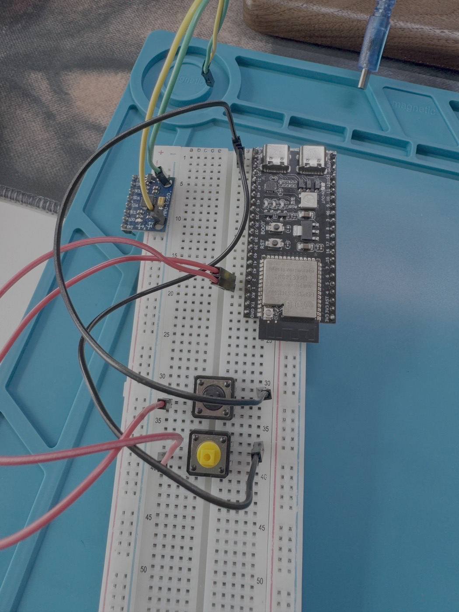
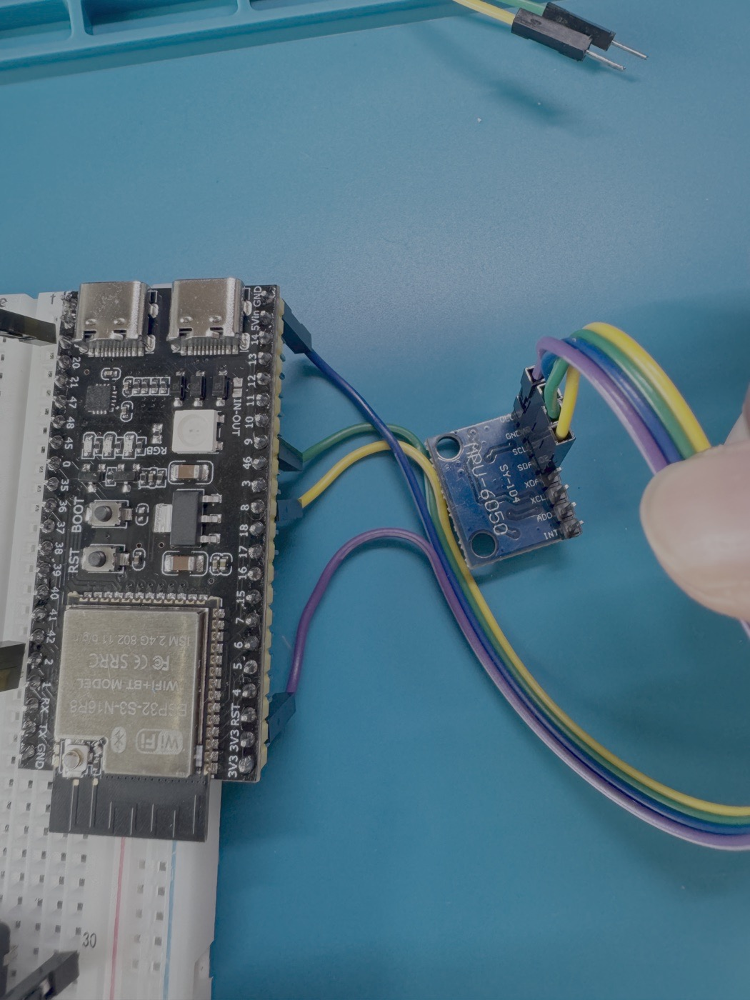

# ESP32-S3 BLE Air Mouse

A motion-controlled Bluetooth Low Energy HID mouse prototype built with an ESP32-S3 and MPU6050 IMU. The device turns hand tilt into cursor movement, supports left and right click buttons, and includes a scroll mode with inertia.

<p>
  
</p>

## Demo

[Watch the prototype demo video](media/air-mouse-demo.mp4)

## Project Goal

This project explores how raw motion sensor data can be transformed into a usable pointing device. The main challenge was making IMU angle readings feel stable enough for mouse control while keeping the response fast enough for real interaction.

## Features

- BLE HID mouse communication
- Motion-based cursor control using MPU6050 angle readings
- Left click and right click hardware buttons
- Button-controlled cursor mode and scroll mode switching
- Deadzone filtering to reduce idle jitter
- Exponential smoothing for steadier cursor movement
- Nonlinear horizontal response for finer control near the center position
- Scroll inertia for smoother scrolling
- Tunable sensitivity and deadzone constants

## Hardware

- ESP32-S3 development board
- MPU6050 accelerometer and gyroscope module
- Push buttons for left click, right click, and mode toggle
- Breadboard and jumper wires

<p>
  
</p>

## Wiring

| Signal | ESP32-S3 GPIO | Purpose |
|---|---|---|
| MPU6050 SDA | GPIO 8 | I2C data line |
| MPU6050 SCL | GPIO 9 | I2C clock line |
| Left click button | GPIO 1 | BLE left mouse button input |
| Right click button | GPIO 2 | BLE right mouse button input |
| Mode button | GPIO 0 | Toggle between cursor and scroll modes |

## How It Works

1. The ESP32-S3 starts BLE HID advertising as `Julian Air Mouse`.
2. The MPU6050 is initialized over I2C and calibrated while the device is still.
3. The main loop reads `AngleX` and `AngleY` from the IMU.
4. Deadzones filter out small movements around the neutral position.
5. Cursor movement is calculated from tilt angle, constrained, then smoothed.
6. In cursor mode, the ESP32-S3 sends BLE mouse movement events.
7. In scroll mode, tilt is converted into scroll velocity with decay for inertia.
8. Hardware buttons are mapped to BLE left click, right click, and mode toggle events.

## Repository Structure

```text
.
|-- README.md
|-- src/
|   `-- air_mouse_v1.ino
|-- images/
|   |-- setup.jpg
|   `-- wiring-detail.jpg
`-- media/
    `-- air-mouse-demo.mp4
```

## Getting Started

1. Open `src/air_mouse_v1.ino` in the Arduino IDE.
2. Install ESP32 board support for the Arduino IDE.
3. Install the required Arduino libraries:
   - `MPU6050_light`
   - `HijelHID_BLEMouse`
4. Select an ESP32-S3 board target.
5. Connect the ESP32-S3 by USB and upload the sketch.
6. Keep the device still during startup calibration.
7. Pair your computer with the BLE device named `Julian Air Mouse`.

## Tuning

The main behavior constants are near the top of `src/air_mouse_v1.ino`:

| Constant | Purpose |
| --- | --- |
| `deadzone` | Ignores small tilt changes around rest position |
| `sensitivityX` | Controls horizontal cursor response |
| `sensitivityY` | Controls vertical cursor response |
| `scrollSensitivity` | Controls scroll speed |
| `scrollDeadzone` | Ignores small tilt changes in scroll mode |
| `scrollDelay` | Controls the interval between scroll events |

## Status

Functional prototype completed. The current build demonstrates BLE pairing, cursor movement, click input, scroll mode, and IMU-based filtering.

## Future Improvements

- Add battery power and charging support
- Design a compact enclosure or custom PCB
- Add presentation mode for slide control
- Add gesture shortcuts
- Explore ROS2 integration for robotics control experiments
